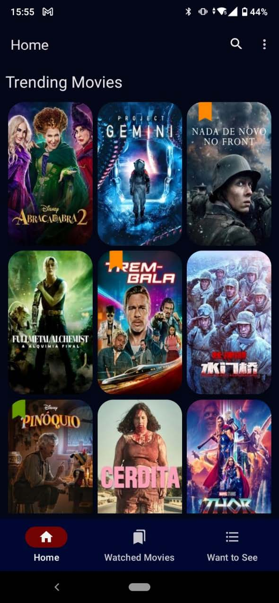
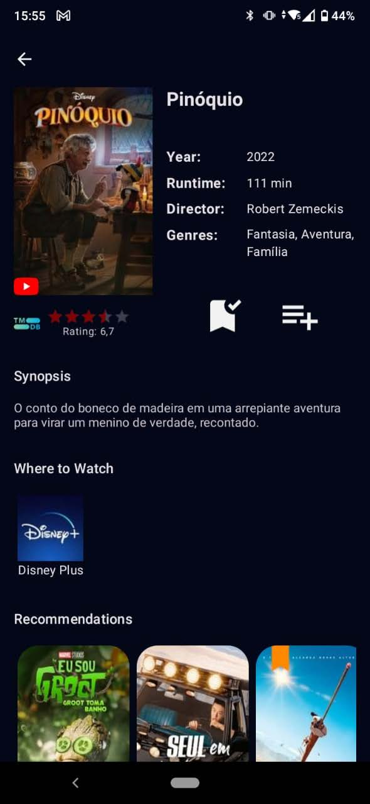
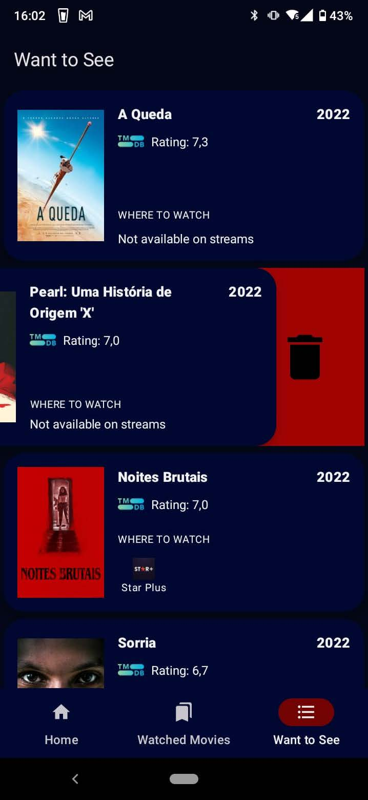

# My Movie List 
## Seja bem-vindo ao repositório de distribuição para testes do app My Movie List!

Nós amamos filmes, e por isso decidimos criar esse aplicativo para pessoas, que como nós, também os amam! Nele você poderá encontrar os detalhes sobre vários filmes e criar uma lista com os que você quer assistir ou, se você realmente ama filmes como nós e deseja se lembrar deles para sempre, poderá registrar os que já assistiu, e a melhor parte, nós ajudamos você a economizar tempo mostrando em qual serviço de streaming ele está disponível!

Então, pegue sua pipoca e aproveite o filme!

Alison Viana,
App Developer

  
_The movie data is provided by The Movie Database [ https://www.themoviedb.org ] and the information about streaming service is from JustWatch [ https://www.justwatch.com/br ]._

_This product uses the TMDB API but is not endorsed or certified by TMDB._

 

## Welcome to the My Movie List!

We love films, that's why we decided to create this app for people who, like us, love them too. Here you can find the details about a lot of movies and create a list with the ones you want to see or if you really love films like us, you probably want to register what you have already watched, the better part, we help you save time by showing on which streaming services you can watch them!

So, grab your popcorn and enjoy the movie!

Alison Viana,
App Developer

  
_The movie data is provided by The Movie Database [ https://www.themoviedb.org ] and the information about streaming service is from JustWatch [ https://www.justwatch.com/br ]._

_This product uses the TMDB API but is not endorsed or certified by TMDB._

  

 
     
     
      

## Versões
### Versão: 2.2.1
Novidades: Diminuímos o consumo de dados utilizados, aperfeiçoamos o histórico de pesquisa e corrigimos alguns pequenos erros.

